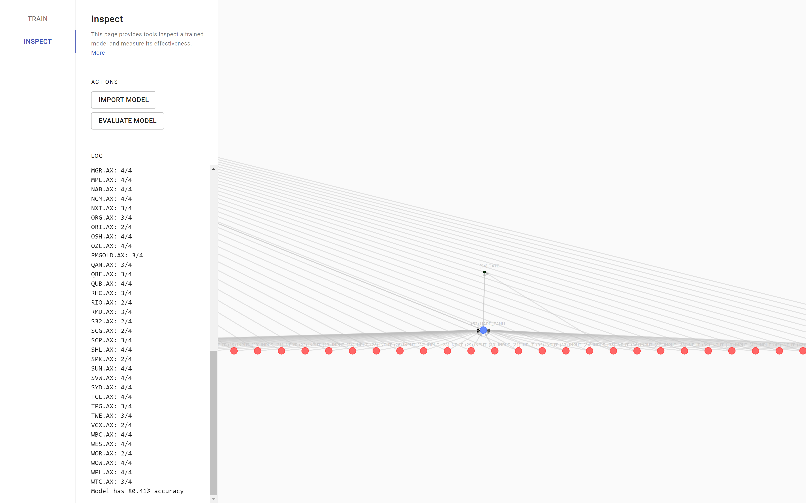

# Inspect

This page visualises the model generated during the training phase and provides functionality to evaluate it.

[See the dataset](https://raw.githubusercontent.com/Spaaaacccee/research-assignment-method-data/master/dataset.json)

## Model Viewer

The nodes and connections of the network is shown. Hover over nodes or connections to see their biases. Hold and drag the nodes to pan the viewport.

## Model Evaluation

The model is put under the same simulation as the training phase. However, a different set of data is used (those with names starting with the second half of the alphabet).

Like during training, over four days the model will be tasked with determing whether to buy or sell the stock as an investor, which in turn influences the simulated stock movement. The model is then judged on how many times it produces a correct prediction. This is run for every company in the dataset.

The network generated in the simulation varies randomly, which results in slightly different results between runs.
