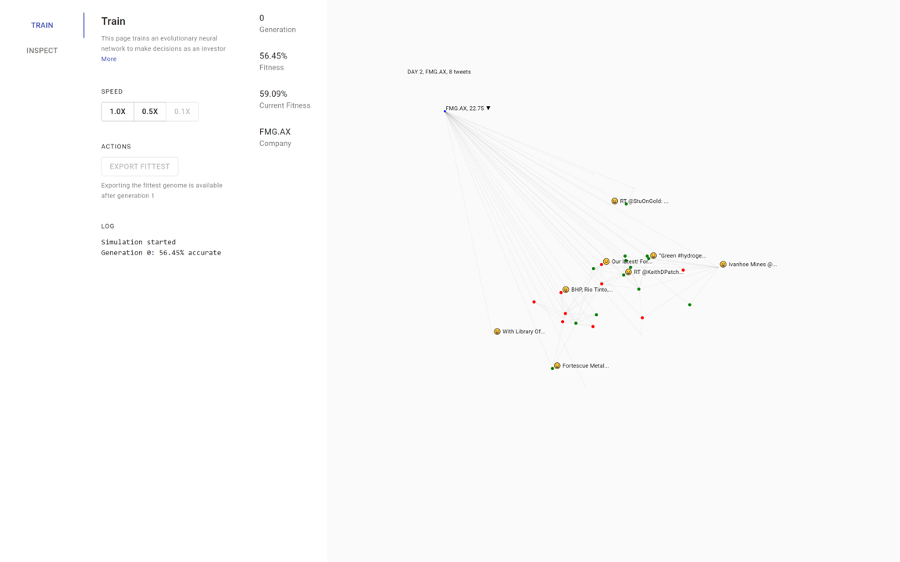

# Train

This page trains an evolutionary neural network to make decisions as an investor with stock prices from 50 of the top ASX companies from 2021-05-05 to 2021-05-13, along with up to 100 Twitter posts for each.

[See the dataset](https://raw.githubusercontent.com/Spaaaacccee/research-assignment-method-data/master/dataset.json)

## Simulation Format

Investors are granted vision (shown by the edges of graph) as well as memory. A green node indicates they have decided to buy, and a red node indicates they have decided to sell. The size of the node indicates their current wealth. All investors can see the current stock price.

Investors also make posts, with their sentiment indicated by a happy/sad emoji. Each investor also has a visibility attribute, which is a measure of their influence. A higher visibility indicates a higher chance its node will be connected to other nodes.

Each trial involves one company and 30 investors. Over three days, investors will be allowed to buy, hold, or sell stocks. The value of the stock at the end of particular day will be determined by the net decision made by the population. A trial is considered successful if it correctly predicts whether the stock increases or decreases in value (no attempts to judge magnitude).

## Neural Network Format

By default, each model will be tested against 10 randomly chosen datasets over three days. The fitness of a model is judged by how many trials are successful. Every generation consists of 50 genomes, the top 10% are crossed over and mutated to form the next generation.
